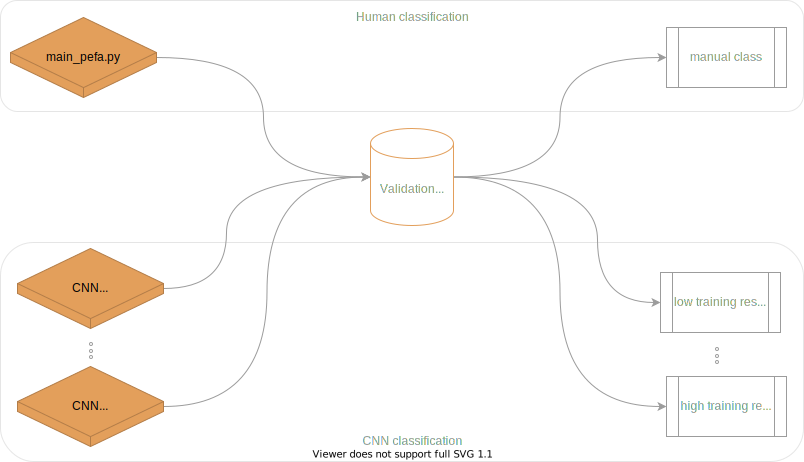

  

### Thought Process

In training the CNN, we can obtain the weights optimized at various stages. The concept here is that we can potentially use the collection of weights to generate numerous predictions per image. 

  

To simplify things, let's consider adult predictions only. As specified above, J = 1,2,...,J indicates the number of surveys (model predictions) completed per ith image, and each survey results in an independant "count" of the focal class ( adults in this case).  

We assume that the count of objects is a Poisson random variable: and for each image, we therefore end up with M_i,j detections. Again for the sake of simplicity, let's consider a single image as depicted above, so we will generate M_j detections. As our model/weights are imperfect, the detections will contain various combinations of false/true positives, and false/true negatives. To automate the estimation of our detection error, we have a number of options, all come from [Chambert et al. 2017](https://besjournals.onlinelibrary.wiley.com/doi/10.1111/2041-210X.12910).

1. Combine binary detection data (binarized count data) with the count data. We also integrate a portion of the dataset that has been manually classified to veryify the *true state*.
2. Use only the binarized count data (reduce all counts to 1 or 0) 
3. Use only the count data.
