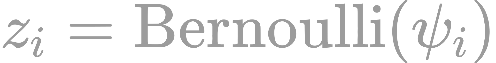
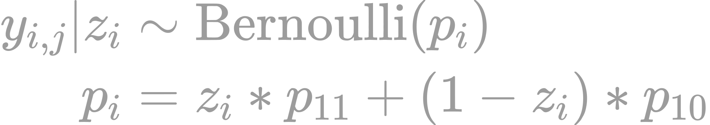

### Thought Process

** No longer relying on CNN to estimate nestling counts** - saving this as a future project. **

In training the CNN, we can obtain the weights optimized at various stages. The concept here is that we can potentially use the collection of weights to generate numerous predictions per image.

  

To simplify things, let's consider adult predictions only, and a single image. As specified above, J = 1,2,...,J indicates the number of surveys (model predictions) completed per ith image (here I = 1), and each survey results in an independant "count" of the focal class ( adults in this case).

We assume that the count of objects is a Poisson random variable, and for each image, we therefore end up with M_i,j detections (M_j detections in this case). As our model/weights are imperfect, the detections will contain various combinations of false/true positives, and false/true negatives. To automate the estimation of our detection error, we have a number of options, all come from [Chambert et al. 2017](https://besjournals.onlinelibrary.wiley.com/doi/10.1111/2041-210X.12910).

1. Combine binary detection data (binarized count data) with the count data. We also integrate a portion of the dataset that has been manually classified to veryify the *true state*.
2. Use only the binarized count data (reduce all counts to 1 or 0)
3. Use only the count data.

### Option 1.

For each image *i* and "survey" *j*, we generate *M_ij* detections. We summarize *M_ij* in two ways, a) as binary detection data *y_ij*, where *y_ij* = 1 if *M_ij* > 0, and b) total number of detections from image *i* of the focal class. We then integrate verified information about the *true status* of image *i*. There are thus four parts to this model:

* the true state of the image
* longitudinal binary detection process
* detection-count process (summed true and false positives)
* reduced data size of verified states

Whether or not a focal class is in the ith image (ie, the true unknowable state), is defined by *z_i* which takes the value of 1 if the object is truly in the image, and 0 of absent. The probability that *z_i* = 1 captured by a Bernoulli distribution with psi_i:

<!-- $$
z_i = \textrm{Bernoulli}(\psi_i)
$$ -->

Similar to occupancy frameworks, we allow for the possibility of false negatives (when an image contains an object of interest, but the CNN misses it), which are conditional on the true occupancy state (we can't have a false negative if *z_i* = 0) with:

<!-- $$
\begin{aligned}
y_{i,j}|z_{i} &\sim \textrm{Bernoulli}(p_i) \\
p_i &= z_i * p_{11} + (1-z_i) * p_{10}
\end{aligned}
$$ -->

At unoccupied sites (*z_i* = 0), any detection is a false positive (p_10), whereas at occupied sites (*z_i* = 1), a detection can either be true or false. Probabilitys p_11 (true detection) and p_10 (false detection) can be written as:

<!-- $$
#9C9C9C
\begin{aligned}
p_{11} &= Pr(y_{ij}=1 | z_i = 1) \\
p_{10} &= Pr(y_{ij}=1|z_i=0)
\end{aligned}
$$ -->

Next, we specify the total number of true detections for image *i* as *K_i* and false detections as *Q_i*. Combined,N_i = total detections = K_i + Q_i, is modelled with two distinct Poisson processes with intensity rate parameters lambda and omega, both of which are conditional on both z_i and y_ij. If at least one detection occurred in image i across all predictions, the N_i = K_i + Q_i is constrained as strictly positive. Because of this constraint, we use a zero truncated poisson distribution to model N_i.

<!-- $$ 
\begin{aligned}
\textrm{When } &w_i=0 \textrm{, we have: } \\
N_i=0, K_i = 0 &\textrm{   and   } Q_i = N_i - K_i = 0 \\
\textrm{and, when } &w_i = 1 \textrm{ we have:} \\
N_i &\sim \textrm{Poisson}(\lambda * z_i + w) \\
K_i &\sim \textrm{Poisson}(\lambda*z_i) \\
Q_i &= N_i - K_i
\end{aligned}
$$ -->

