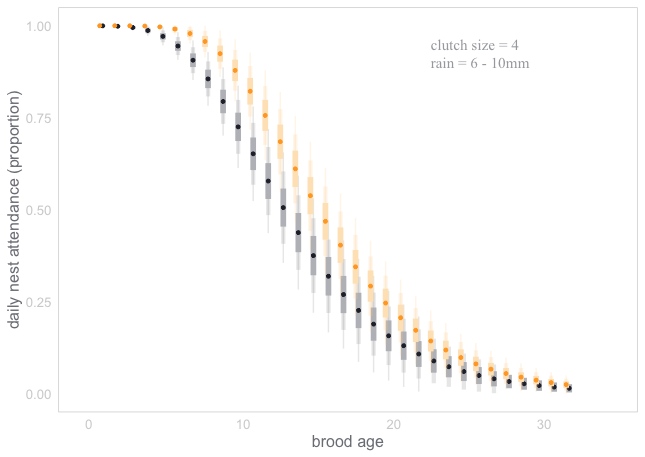

# Automating image processing using CNNs, and exploring the tradeoffs of automation

### Introduction
The goal of this project is to demonstrate how deep learning methods can automate the processing of imagery data, which in turn opens up new opportunities for inference. To this end, we use data generated by a long-term monitoring program that installs cameras at Peregrine Falcon breeding locations in the Canadian Arctic. Depending on the number of active nests, the program captures roughly 2.5 million images yearly, and manually classifying each image is impossible without investing substantial resources. As a result, only a small subset of images that capture discrete events of interest (nestling hatching, provisioning, etc.) are processed from each year, and the remaining data is archived. 

Here, we build a CNN capable of accurately detecting four main classes: **Peregrine adults**, **nestlings**, **eggs**, and **leg bands** (aluminum and Acraft separately) within each image. In doing so, we generate time-series data that captures adult nest attendance throughout the population/season at a minute-by-minute resolution.

### General Workflow

  

 
  

### Concept DAG
To demonstrate how the CNN can be used with this dataset, we look at nest attendance among breeding pairs of PEFA. After nestlings hatch, they are unable to independantly thermoregulate and therefore rely on warmth/shelter provided by brooding from their parents. Time spent brooding means less time available to the parents for hunting and self maintenance. This is likely a manageable tradeoff at the early stages of brood rearing as nestlings have relatively low energetic requirements.

As nestlings age and develop, their energy requirements increase and parents have to address this by investing more time into food acquisition. Because time is limiting, an increase in hunting frequency likely comes at a cost to brooding time. As nestlings grow and develop however, their ability to independantly thermoregulate increases (they reach full independance by 21 days of age), and require less brooding from the parents. A shift from brooding to hunting is likely a manageable transition under ideal circumstances, however the north is experiencing increased frequency in inclement weather events (ie. heavy rainfall). When the nestling's down gets wet, they become much more susceptible to lower temperatures which can lead to mortality. Depending on the nature of the inclement weather (temperature, rainfall intesnsity/duration) nestlings can be protected from weather by parental brooding, but again, time allocated to brooding is time taken away from food acquisition. 

In less favourable weather, parents therefore enter some tricky decision making territory. How much time they invest in brooding vs. food aquisition likely depends on a few factors: 
 * __Risk to brood from food limitation__. If a brood is already severely food limited, and a lack of energy poses an immediate threat, parents may opt to continue hunting. The state of food limitation (and thus decision making) is likely linked to energetic requirements of the brood (age, brood size), and food availability leading up to the inclement weather (seasonal conditions, prey population state).
 * __Risk to brood from weather event__. If the weather event poses a greater risk to brood reduction, we predict that the adult would prioritize brooding. The susceptability of the brood to weather is linked to brood age (thermoregulatory ability), brood size (huddling ability), brood condition, and environmental conditions (temperature, rain intensity, etc.).
 * __Adult condition__. If times are tough, adult condition reaches a lower limit where self maintenance may take precedence. This is likely linked to seasonal conditions and overall prey availability leading up to the weather event.

### Concept 
To demonstrate how the CNN can be used with this dataset, we look at nest attendance among breeding pairs of PEFA. After nestlings hatch, they are unable to independantly thermoregulate and rely on warmth/shelter from their parents. Time that parents allocate to brooding is time not spent hunting or self maintenaning. This is likely a manageable tradeoff at the early stages of brood rearing as nestlings have relatively low energetic requirements.

As nestlings age and develop, their energy requirements increase and parents have to shift their time allocation to keep up with the increasing energetic demands. This coincides with nestling's increasing ability to thermoregulate (they reach full independance by 21 days of age), which reduces the risk of exposure and permits the parents to spend more time away from the nest with less risk. This is all great under ideal circumstances, however the north is experiencing increased frequency in inclement weather events (ie. heavy rainfall). When the nestling's down gets wet, they become much more susceptible to lower temperatures, which can lead to mortality. The risk of brood reduction due to rainfall is buffered by parental sheltering, but again, time allocated to sheltering is time taken away from food acquisition. In these circumstances, we enter some tricky decision making territory for adults. How they decide to allocate their time depends on a couple factors: 
 * Tradeoff between starvation risk and exposure risk
 * Adult condition. If times are tough, adult condition reaches a lower limit where self maintenance takes precedence. 

  

## Modeling
  
Two options to be explored next. In visualizing the data, we can clearly see that nest attendance decreases with brood size/age, but this trend is interrupted during rain events, during which nest attendance increases. The relationship between brood age/size and nest attendance is nonlinear, so we can approximate the relationship using nonlinear regression. There are a number of interacting elements however, and I want to also explore the use of bayes nets to learn and estimate the overall DAG structure.

## Nestlings

CNN has been trained and is achieving 97% accuracy with adults, 92% accuracy with eggs, and band classes. Nestlings are more difficult (currently at 75%), see below. Nestling inaccuracies likely stem from human error during annotation. When shown random images containing nestlings, it's often very difficult to differentiate individuals in the image due to overexposure.

  

Errors made in manual annotation are propogated in the CNN. Eventually, it would be nice to build methods that can account for imperfect estimates of brood size, but for now, we'll use brood size information as determined by physical nest visits.
  

## Model

Ultimately, we want to model nest attendance and the downstream effects attendance has on nestling survival. Nest attendance and nestling survival are distinct processes influenced by unique variables, but they are also presumably linked causally, and through shared covariates. Causally, we assume that adults who spend more time brooding their young during bouts of inclement weather increase the chances of nestling survival. Through shared covariates, an adult's ability to devote time to nest attendance is likely influenced by the availability of food, which in turn is likely linked to the condition of nestlings, and thus survival. Both nestling survival probabilities and the amount of time an adult spends at the nest may also be equally influenced by brood age. With many shared covariates and causal relationships between nest attendance and nestling survival, understanding factors influencing nest attendance and downstream effects on nestling survival requires an appropriate consideration of interacting variables affecting both processes. 

To examine this network of effects, we use a Bayesian Network.

### 1. Non-linear model

The first step was to model the relationship between daily nest attendance (total minutes adult detected at the nest / total minutes in a day) and a few metrics that represented brood independance. I started by modeling nest attedance against total brood weight. Total brood weight provided a single covariate summary of brood age, and clutch size, and I hoped that it would simplify the modeling process as a result. It did, but I wasn't happy with the fact that total brood weight could represent drastically different realities. For example, a brood weight of 150 could be a single 10 day old nestling, or a full clutch of 3 day old nestlings. Both scenarios demand drastically different parental behaviours.

No matter what I used to model nest attendance against, it was clear that the relationships were all non-linear. Furthermore, our response variable was in the scale of proportions, and contained *both* zeros and ones. I thought about using a zero-one-inflated Beta model with a non-linear structure, but instead chose to use a negative logistic function and constrained the function to predict in the 0 <= >= 1 range. 

Model diagnostics look good, and skipping to the punch line, estimates indicate that in all scenarios, supplemented broods enjoy increased parental attendance. By all scenarios, I mean all clutch sizes, across all ages, across a number of different rainfall scenarios. The rainfall scenarios are where the increased nest attendance really shows up, which follows our predictions. I'll flesh these visuals out, but for starters, here is a range of nest attendance predictions for a clutch of four nestlings at various ages when the daily rainfall totals 6-10mm.

I'd like to supplement this with a visual of nestling mortality in this scenario across all ages so we can investigate links between nest attendance and mortality.

  

### 2. Bayesian Nets
This section is to really solidfy the causal pathways between interacting covariates, nest attendance, and ultimately nestling survival. I'll work on this after non-linear models are finalized (very soon).