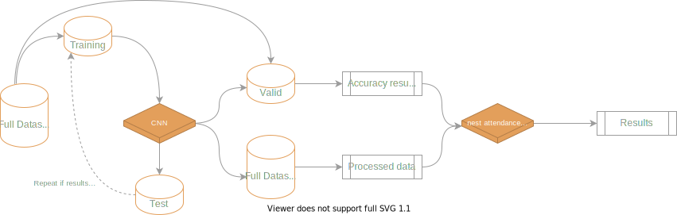
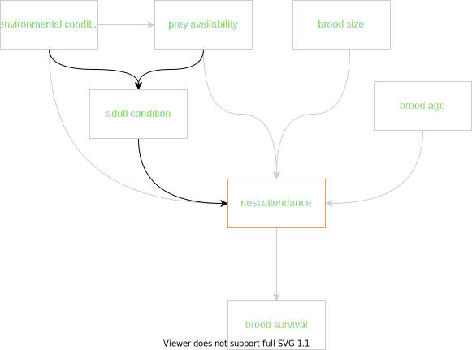
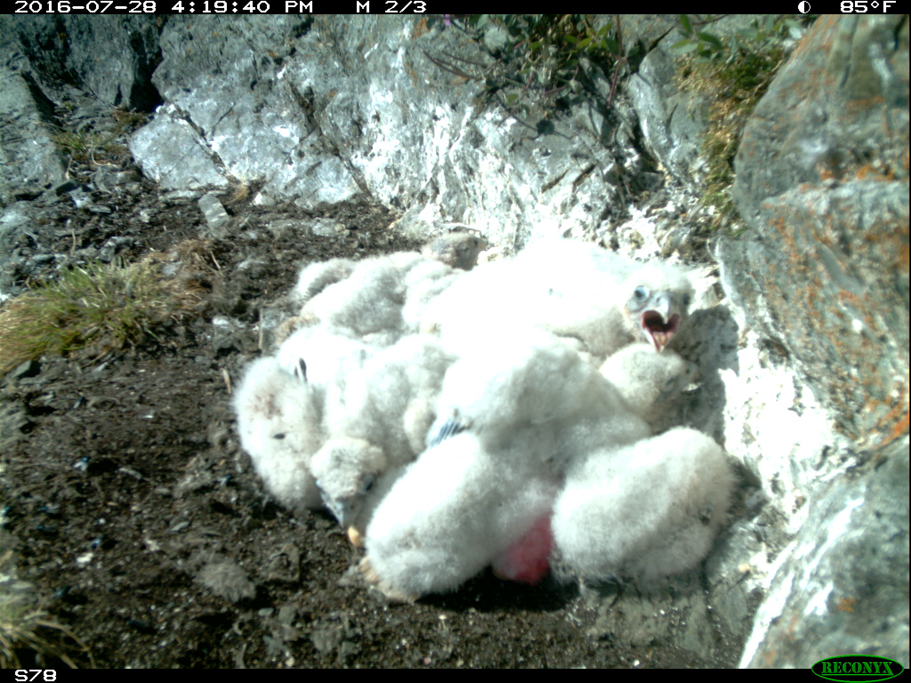

# Automating image processing using CNNs, and exploring the tradeoffs of automation

### Introduction
The goal of this project is to demonstrate how deep learning methods can automate the processing of imagery data, and in dong so, open up new opportunities for inference. To this end, we use data generated by a long-term monitoring program that installs cameras at Peregrine Falcon breeding locations in the Canadian Arctic. Depending on the number of active nests, the program captures roughly 2.5 million images yearly, and manually classifying each image is impossible without investing substantial resources. As a result, a small subset of images that capture discrete events of interest (nestling hatching, provisioning, etc.) are processed from each year, and much of the data is archived in an un-usable format.

Here, we build a CNN capable of accurately detecting four main classes: **Peregrine adults**, **nestlings**, **eggs**, and **leg bands** (aluminum and Acraft separately) within each image. In doing so, we efficiently generate time-series data from each year that can be modeled to gain inference about breeding behaviour and demography. 

### General Workflow

  

 
  

### Concept DAG
To demonstrate how the CNN can be used with this dataset, we look at nest attendance among breeding pairs of PEFA. After nestlings hatch, they are unable to independantly thermoregulate and therefore rely on warmth/shelter provided by brooding from their parents. Time spent brooding means less time available to the parents for hunting and self maintenance. This is likely a manageable tradeoff at the early stages of brood rearing as nestlings have relatively low energetic requirements.

As nestlings age and develop, their energy requirements increase and parents have to address this by investing more time into food acquisition. Because time is limiting, an increase in hunting frequency likely comes at a cost to brooding time. As nestlings grow and develop however, their ability to independantly thermoregulate increases (they reach full independance by 21 days of age), and require less brooding from the parents. A shift from brooding to hunting is likely a manageable transition under ideal circumstances, however the north is experiencing increased frequency in inclement weather events (ie. heavy rainfall). When the nestling's down gets wet, they become much more susceptible to lower temperatures which can lead to mortality. Depending on the nature of the inclement weather (temperature, rainfall intesnsity/duration) nestlings can be protected from weather by parental brooding, but again, time allocated to brooding is time taken away from food acquisition. 

In less favourable weather, parents therefore enter some tricky decision making territory. How much time they invest in brooding vs. food aquisition likely depends on a few factors: 
 * __Risk to brood from food limitation__. If a brood is already severely food limited, and a lack of energy poses an immediate threat, parents may opt to continue hunting. The state of food limitation (and thus decision making) is likely linked to energetic requirements of the brood (age, brood size), and food availability leading up to the inclement weather (seasonal conditions, prey population state).
 * __Risk to brood from weather event__. If the weather event poses a greater risk to brood reduction, we predict that the adult would prioritize brooding. The susceptability of the brood to weather is linked to brood age (thermoregulatory ability), brood size (huddling ability), brood condition, and environmental conditions (temperature, rain intensity, etc.).
 * __Adult condition__. If times are tough, adult condition reaches a lower limit where self maintenance may take precedence. This is likely linked to seasonal conditions and overall prey availability leading up to the weather event.

  

## Status
On-going.

CNN has been trained and is achieving 97% accuracy with adults, 92% accuracy with eggs, and band classes. Nestlings are more difficult (currently at 75%), see below. Nestling inaccuracies likely stem from human error during annotation. When shown random images containing nestlings, it's often very difficult to differentiate individuals in the image due to overexposure.

  

Determining the correct number of nestlings in a picture is difficult for humans as well, which means that many of the images used in the training dataset likely include error. Errors made in manual annotation are propogated in the CNN. Eventually, it would be nice to build methods that can account for imperfect estimates of brood size, but for now, we'll use brood size information as determined by physical nest visits.

## Model

Ultimately, we want to model nest attendance and the downstream effects attendance has on nestling survival. Nest attendance and nestling survival are distinct processes influenced by unique variables, but they are also presumably linked causally, and through shared covariates. Causally, we assume that adults who spend more time brooding their young during bouts of inclement weather increase the chances of nestling survival. Through shared covariates, an adult's ability to devote time to nest attendance is likely influenced by the availability of food, which in turn is likely linked to the condition of nestlings, and thus survival. Both nestling survival probabilities and the amount of time an adult spends at the nest may also be equally influenced by brood age. With many shared covariates and causal relationships between nest attendance and nestling survival, understanding factors influencing nest attendance and downstream effects on nestling survival requires an appropriate consideration of interacting variables affecting both processes. 

To examine this network of effects, we use a Bayesian Network.

