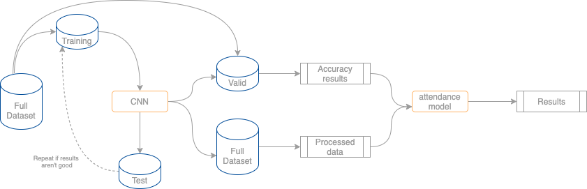
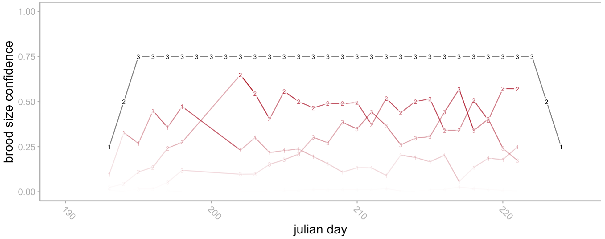

## Automating image processing using CNNs, and exploring the tradeoffs of automation

  

This folder contains work done to automatically detect objects in images using an object detection CNN. Here, we focus on detecting four main objects: **adults**, **nestlings**, **eggs**, and **leg bands**. The motivation of this work is to streamline the process of image transcription for projects implementing some form of nest monitoring using cameras. 

 
 

### Remaining work
 

### Project Outline

The goal of the project is to demonstrate deep learning methods through application. The project is characterized by three main components:
- [x] Build a tailored object detector
- [x] Use resulting CNN to process nest camera footage
- [ ] Use processed photos to make inference about nest attendance, and links to weather and brood state 

 
 
 

## Status
On-going.

CNN has been trained and is achieving 97% accuracy with adults, 92% accuracy with eggs, and band classes. Nestlings are more difficult (currently at 75%), see below. Image augmentation could boost accuracy, although adult detection may not get much higher. Nestling inaccuracies likely stem from human error during annotation. When shown random images containing nestlings, it's often very difficult to differentiate individuals in the image due to overexposure, and the CNN is therefore being trained on an imperfect dataset. I suspect the accuracy of the CNN is similar to the accuracy of a human randomly classifying nest images, I'm working on confirming that.

### Brood size

#### Problem
Currently, the yolo estimation of chicks isn't accurate. This has to do with the fact that nestlings huddle together and appear as a white overexposed blob in the middle of the picture. I don't think a human could do better, but when humans evaluate images, we have the benefit of using information from previous images / nest visits. For example, if we know there were three distinct nestlings in an image from earlier in the day, and there's been no indication that a nestling has died since, we "smooth" the nestling counts in our mind and assume the white overexplosed blob of nestlings is in fact three individuals. Yolo doesn't have that luxury, since it has to provide us with data for each image independantly. For example:

  

The true brood size is drawn in black, with model predictions in red. The model predicts varying brood sizes across pictures according to how clumped together the nestlings are. The "confidence", as defined in this figure, is determined by the proportion of predictions for each brood size in a given day. so if there is a 75% confidence of a brood size of 2, that means two nestlings were detected in 75% of the images from that particular day.

### Solutions

 - **Option 1** - 
Retrain using object tracking. This would smooth the prediction across images by integrating something like deepsort via tensorflow. See [this repo](https://github.com/GeekAlexis/FastMOT), or [this one](https://github.com/LeonLok/Deep-SORT-YOLOv4) for examples. One issue with this method stems from the fact that we're not actually using video, or high frame rates. There are large gaps in the sequence of images, which introduces potential bias in tracking individuals. 

 - **Option 2** - 
Build a model that corrects predictions according to data obtained during nest visits. For example, we fill in the missing covariate information using a bayesian sub-model that is guided with real, confirmed data obtained during physical nest visits.

 -  **Option 3** - 
Binarize nestlings. Many nest-fate models do this anyways, and incorporate broad categories such as brood initiation / brood failure / brood success.

-  **Option 4** - 
Implement a multievent model. Detecting nestlings on camera fits well with a mark-recap framework, and if we can successfully inject measurement error into the recaps, we could potentially automate the whole process (idea inspired by [this paper](https://link.springer.com/article/10.1007/s10336-011-0723-0))

First choice will be option 4 for now.

 
 
 

