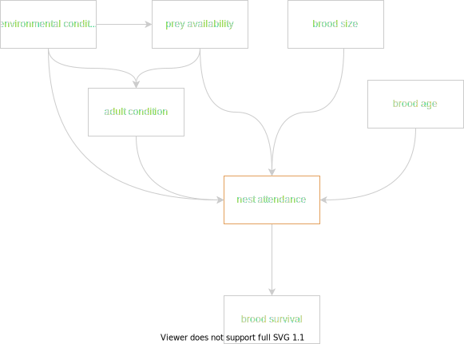

# Automating image processing using CNNs, and exploring the tradeoffs of automation

### Introduction
The goal of this project is to demonstrate how deep learning methods can automate the processing of imagery data, and in dong so, open up new opportunities for inference. To this end, we use data generated by a long-term monitoring program that installs cameras at Peregrine Falcon breeding locations in the Canadian Arctic. Depending on the number of active nests, the program captures roughly 2.5 million images yearly, and manually classifying each image is impossible without investing substantial resources. As a result, a small subset of images that capture discrete events of interest (nestling hatching, provisioning, etc.) are processed from each year, and much of the data is archived in an un-usable format.

Here, we build a CNN capable of accurately detecting four main classes: **Peregrine adults**, **nestlings**, **eggs**, and **leg bands** (aluminum and Acraft separately) within each image. In doing so, we efficiently generate time-series data from each year that can be modeled to gain inference about breeding behaviour and demography. 

### General Workflow

  

 
  

### Concept DAG

  

## Status
On-going.

CNN has been trained and is achieving 97% accuracy with adults, 92% accuracy with eggs, and band classes. Nestlings are more difficult (currently at 75%), see below. Nestling inaccuracies likely stem from human error during annotation. When shown random images containing nestlings, it's often very difficult to differentiate individuals in the image due to overexposure.

  

Determining the correct number of nestlings in a picture is difficult for humans as well, which means that many of the images used in the training dataset likely include error. Errors made in manual annotation are propogated in the CNN. Eventually, it would be nice to build methods that can account for imperfect estimates of brood size, but for now, we'll use brood size information as determined by physical nest visits.

