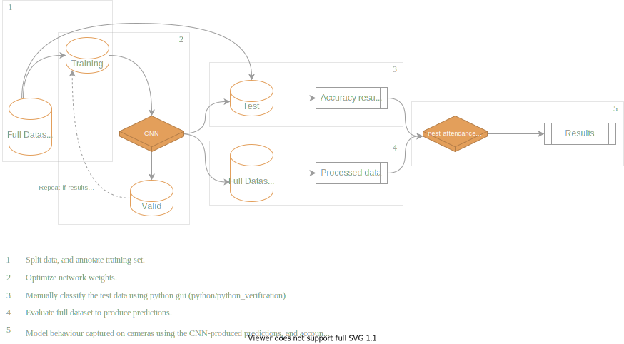

# Automating image processing using CNNs, and exploring the tradeoffs of automation

### Introduction
The goal of this project is to demonstrate how deep learning methods can automate the processing of imagery data, which in turn opens up new opportunities for inference. To this end, we use data generated by a long-term monitoring program that installs cameras at Peregrine Falcon breeding locations in the Canadian Arctic. Depending on the number of active nests, the program captures roughly 2.5 million images yearly, and manually classifying each image is impossible without investing substantial resources. As a result, only a small subset of images that capture discrete events of interest (nestling hatching, provisioning, etc.) are processed from each year, and the remaining data is archived. 

Here, we build a CNN capable of accurately detecting four main classes: **Peregrine adults**, **nestlings**, **eggs**, and **leg bands** (aluminum and Acraft separately) within each image. In doing so, we generate time-series data from all active nests within each year, and accumulate data that describes adult nest attendance throughout the population/season at a minute-by-minute resolution.

### General Workflow

  

 
  

### Concept 
To demonstrate how the CNN can be used with this dataset, we look at nest attendance among breeding pairs of PEFA. After nestlings hatch, they are unable to independantly thermoregulate and rely on warmth/shelter from their parents. Time that parents allocate to brooding is time not spent hunting or self maintenaning. This is likely a manageable tradeoff at the early stages of brood rearing as nestlings have relatively low energetic requirements.

As nestlings age and develop, their energy requirements increase and parents have to shift their time allocation to keep up with the increasing energetic demands. This coincides with nestling's increasing ability to thermoregulate (they reach full independance by 21 days of age), which reduces the risk of exposure and permits the parents to spend more time away from the nest with less risk. This is all great under ideal circumstances, however the north is experiencing increased frequency in inclement weather events (ie. heavy rainfall). When the nestling's down gets wet, they become much more susceptible to lower temperatures, which can lead to mortality. The risk of brood reduction due to rainfall is buffered by parental sheltering, but again, time allocated to sheltering is time taken away from food acquisition. In these circumstances, we enter some tricky decision making territory for adults. How they decide to allocate their time depends on a couple factors: 
 * Tradeoff between starvation risk and exposure risk
 * Adult condition. If times are tough, adult condition reaches a lower limit where self maintenance takes precedence. 

  

## Modeling
  
Two options to be explored next. In visualizing the data, we can clearly see that nest attendance decreases with brood size/age, but this trend is interrupted during rain events, during which nest attendance increases. The relationship between brood age/size and nest attendance is nonlinear, so we can approximate the relationship using nonlinear regression. There are a number of interacting elements however, and I want to also explore the use of bayes nets to learn and estimate the overall DAG structure.

## Nestlings

CNN has been trained and is achieving 97% accuracy with adults, 92% accuracy with eggs, and band classes. Nestlings are more difficult (currently at 75%), see below. Nestling inaccuracies likely stem from human error during annotation. When shown random images containing nestlings, it's often very difficult to differentiate individuals in the image due to overexposure.

  

Errors made in manual annotation are propogated in the CNN. Eventually, it would be nice to build methods that can account for imperfect estimates of brood size, but for now, we'll use brood size information as determined by physical nest visits.
  

